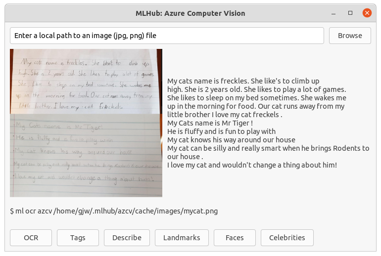

# azcv --- Azure Computer Vision {#azcv}

`r CiteDate(20200806)` The [MLHub](https://mlhub.ai) package
[azcv](https://github.com/gjwgit/azcv) utilises the [Azure Computer
Vision](https://docs.microsoft.com/en-us/azure/cognitive-services/Computer-vision)
cloud API to access closed source pre-built models. The package
provides a demonstration, a graphical user interface, and command line
tools that utilise the pre-built models.

Individual command line tools are packaged for common computer vision
tasks including image analysis to extract descriptions of the images,
word recognition from images, landmark identification, thumbnail
generation, and more. The command line tools can be used within
command pipelines for tasks including the tagging of personal photos
folder, analysis of images from a cameras monitoring a bird feeder,
reading street signs to support a driver, and reading handwritten
texts.

A free Azure subscription allowing up to 5,000 transactions per month
with a maximum of 20 per minute (last checked at [Azure
Pricing](https://azure.microsoft.com/en-gb/pricing/details/cognitive-services/computer-vision/)
20210316) is available from <https://azure.microsoft.com/free/>. After
subscribing visit <https://portal.azure.com> and Create a resource
under AI and Machine Learning called Cognitive Services. Once created
you can access the web API subscription key and endpoint from the
portal. This will be prompted for when running a command, and then
saved to file to reduce the need for repeated authentication requests.

*These Azure models, unlike the MLHub models in general, use **closed
source services** which have no guarantee of ongoing availability and
do not come with the freedom to modify and share.*

Most of the other commands take an image as a parameter which may be a
URL or a path to a local file. For brevity through this chapter the
URLs we use are short URLs generated through
[bitly](https://bitly.com).


<!---------------------------------------------------------------------->
## azcv demo
<!---------------------------------------------------------------------->

To run a canned demonstration

```bash
$ ml demo azcv
```

This begins with:

```
=========================
Azure Computer Vision API
=========================

Welcome to a demo of pre-built models for Computer Vision available as
Cognitive Services on Azure.  Azure supports various operations
related to Computer Vision and this package demonstrates them and
provides command line tools for specific tasks, including tag,
describe, landmark, ocr, and thumbnail.

[...]

================
Analyze an image
================

[...]

Location: https://upload.wikimedia.org/ Path:
wikipedia/commons/thumb/1/12/Broadway_and_Times_Square_by_night.jpg/
Filename: 450px-Broadway_and_Times_Square_by_night.jpg

Close the graphic window using Ctrl-W.

Press Enter to continue: 

============
Tag Analysis
============

We list the tags for the image together with a measure of confidence.

Confidence: 1.00 Tag: skyscraper
Confidence: 0.99 Tag: building
Confidence: 0.97 Tag: outdoor
Confidence: 0.92 Tag: light
Confidence: 0.88 Tag: street
Confidence: 0.88 Tag: cityscape

[...]
```

<!---------------------------------------------------------------------->
## azcv gui
<!---------------------------------------------------------------------->

To run a simple interactive GUI:

```bash
$ ml gui azcv
```



<!---------------------------------------------------------------------->
## azcv quick start
<!---------------------------------------------------------------------->

Here we list command line examples for each of the commands available
in the package. To get full value from the examples, install
[MLHub](https://mlhub.ai) and then install
[azcv](https://github.com/gjwgit/azcv), then run the command on the
command line. The examples are expanded upon through the following
sections.

Identify the **category**s of a photo of the Colosseum:

```bash
ml category azcv https://bit.ly/3lfNVG6
```
<!--  https://raw.githubusercontent.com/Azure-Samples/cognitive-services-sample-data-files/master/ComputerVision/Images/landmark.jpg -->

To identify **landmarks** within a photo of Singapore's Marina Bay Sands:

```bash
ml landmarks azcv https://bit.ly/3vnuG24
```

<!-- http://cdn1.thr.com/sites/default/files/2013/11/marina_bay_sands_singapore_a_l.jpg -->

To generate **tags** suitable for a photo of Australia's Uluru:

```bash
ml tags azcv https://bit.ly/3cqDonC
```

<!-- https://www.wayoutback.com.au/assets/Uploads/Uluru.jpg -->

To identify any **celebrities** in an photo of faces:

```bash
ml celebrities azcv https://bit.ly/2OoC9xr
```

<!-- https://res.cloudinary.com/uktv/image/upload/v1402498133/mztwkl0sze26zjpc0xdh.jpg -->

To identify the bounding boxes of **objects** within a photo of a skateboarder:

```bash
ml objects azcv https://bit.ly/3eFlaSe
```

<!-- https://raw.githubusercontent.com/Azure-Samples/cognitive-services-sample-data-files/master/ComputerVision/Images/objects.jpg -->

To **ocr** handwritten text in a photo of a page:

```bash
ml ocr azcv https://bit.ly/2Op1qYk
```

<!-- https://github.com/gjwgit/azcv/raw/master/images/mycat.png -->

To **ocr** a photo of street signs:

```bash
ml ocr azcv https://bit.ly/38F0FBj
```

<!-- https://farm4.staticflickr.com/3883/15144849957_f326e03f75_b.jpg -->

To generate a **thumbnail** of a photo of Australia's Uluru:

```bash
ml thumbnail azcv https://www.wayoutback.com.au/assets/Uploads/Uluru.jpg
```

<!-- https://www.wayoutback.com.au/assets/Uploads/Uluru.jpg -->

Identify any recognisable **brands** within a photo of a sweater:

```bash
ml brands azcv https://bit.ly/3qIKBo1
```

<!-- https://docs.microsoft.com/en-us/azure/cognitive-services/computer-vision/images/gray-shirt-logo.jpg -->

Identify the bounding boxes of **faces** within a photo:

```bash
ml faces azcv https://bit.ly/38GgwPP
```

<!-- https://raw.githubusercontent.com/Azure-Samples/cognitive-services-sample-data-files/master/ComputerVision/Images/faces.jpg -->

What is the primary **color** within a photo:

```bash
ml color azcv https://bit.ly/3qHlAcY
```

<!-- https://docs.microsoft.com/en-us/azure/cognitive-services/Computer-vision/images/mountain_vista.png -->

The **type** of the image:

```bash
ml type azcv https://bit.ly/3bNGSBv
```

<!-- https://docs.microsoft.com/en-us/azure/cognitive-services/Computer-vision/images/cheese_clipart.png -->


<!---------------------------------------------------------------------->
## azcv category
<!---------------------------------------------------------------------->

The **category** command takes an image and categorises it using a
taxonomy of [86
concepts](https://docs.microsoft.com/en-us/azure/cognitive-services/Computer-vision/concept-categorizing-images). Top
level categories include animal, food, people, indoor, outdoor,
etc. These are then further categorised into, for example, animal_dog,
food_fast, people_group, indoor_court, outdoor_house, etc.

This first example of the Colosseum in Rome is categorised as a
building, though only with a 32% certainty. Other categories are also
identified, with even less certainty.

:::: {style="display: flex;"}

::: {}

```{r echo=FALSE, cache=TRUE, fig.align="left", out.width="50%"}
include_graphics_url("https://bit.ly/3lfNVG6")
```

::: 

::: {}

```bash
$ ml category azcv https://bit.ly/3lfNVG6
0.32,building_
0.00,others_
0.04,outdoor_
```

:::

::::

This photo of a dog, a sample provided by Microsoft, is categorised
100% as animal_dog!

:::: {style="display: flex;"}

::: {}

```{r echo=FALSE, cache=TRUE, fig.align="left", out.width="50%"}
include_graphics_url("https://bit.ly/30JcORa")
```

:::

::: {}

<!--  https://docs.microsoft.com/en-us/azure/cognitive-services/Computer-vision/images/cute_dog.png -->

```bash
$ ml category azcv https://bit.ly/30JcORa
1.00,animal_dog
```

:::

::::

<!---------------------------------------------------------------------->
## azcv celebrities
<!---------------------------------------------------------------------->

```{r echo=FALSE, cache=TRUE, fig.align="left", out.width="40%"}
include_graphics_url("https://bit.ly/38GgwPP")
```

```bash
$ ml celebrities azcv https://bit.ly/38GgwPP
1.00,Bern Collaco
```

```{r echo=FALSE, cache=TRUE, fig.align="left", out.width="40%"}
include_graphics_url("https://bit.ly/38JwUPC")
```

```bash
$ ml celebrities azcv https://bit.ly/38JwUPC
1.00,DJ Khaled
0.85,Rap Monster
```

<!-- https://btsdiary.files.wordpress.com/2018/05/5b2f1-32121566_1259390040861517_2564742387981090816_n.jpg -->

```{r echo=FALSE, cache=TRUE, fig.align="left", out.width="40%"}
include_graphics_url("https://bit.ly/2OoC9xr")
```

```bash
$ ml celebrities azcv https://bit.ly/2OoC9xr
1.00,Bradley Cooper
0.94,Ellen DeGeneres
0.76,Brad Pitt
```

<!---------------------------------------------------------------------->
## azcv describe
<!---------------------------------------------------------------------->

`r CiteDate(20210316)` The contents of a photo can be **describe**d.

This first example of the Eiffel Tower is a little mislead with what
looks like a clock in there somewhere, giving certainties close to
70%.

```{r echo=FALSE, cache=TRUE, fig.align="left", out.width="30%"}
include_graphics_url("https://bit.ly/3bMQX1E")
```

```bash
$ ml describe azcv https://bit.ly/3bMQX1E
0.71,a large clock tower towering over Eiffel Tower
0.66,a large clock tower towering over the city of london with Eiffel Tower in the background
0.66,the tower of the city with Eiffel Tower in the background
```

With similar confidences, Marina Bay Sands is also described:

```{r echo=FALSE, cache=TRUE, fig.align="left", out.width="30%"}
include_graphics_url("https://bit.ly/3vnuG24")
```

```console
$ ml describe azcv https://bit.ly/3vnuG24
0.65,a boat is docked next to a body of water with Marina Bay Sands in the background
0.65,a large body of water with Marina Bay Sands in the background
0.65,a boat docked next to a body of water with Marina Bay Sands in the background
```


```{r echo=FALSE, cache=TRUE, fig.align="left", out.width="30%"}
include_graphics_url("https://bit.ly/3cqDonC")
```
```console
$ ml describe azcv https://bit.ly/3cqDonC
0.92,a canyon with a sunset in the background with Uluru in the background
0.88,a view of a canyon with a sunset in the background with Uluru in the background
0.86,a close up of a canyon with a sunset in the background with Uluru in the background
```

<!--
 ```{r echo=FALSE, cache=TRUE, fig.align="left", out.width="30%"}
 include_graphics_url("https://access.togaware.com/landmark02.jpg")
 ```

 ```console
 $ ml describe azcv https://access.togaware.com/landmark02.jpg
 0.92,a large skyscraper in front of Taipei 101
 0.92,a large skyscraper in front of a tall building with Taipei 101 in the background
 0.92,a tall building with Taipei 101 in the background
 ```
-->

<!---------------------------------------------------------------------->
## azcv faces
<!---------------------------------------------------------------------->

`r CiteDate(20210317)` The **faces** command will run a model to
identify faces in the photo, returning the bounding box, whether the
face is male or female, and the age. One line of text is returned for
each face identified.

```{r echo=FALSE, cache=TRUE, fig.align="left", out.width="50%"}
include_graphics_url("https://raw.githubusercontent.com/gjwgit/azcv/master/docs/faces_bb.png")
```

```console
$ ml faces azcv https://bit.ly/38GgwPP
118 159 212 253,Male,39
492 111 582 201,Male,54
18 153 102 237,Female,55
386 166 467 247,Female,33
235 158 311 234,Female,18
323 163 391 231,Female,8
```

See Section \@ref(adding-bounding-boxes-to-a-photo) to draw
bounding boxes on to a photo.

<!---------------------------------------------------------------------->
## azcv landmarks
<!---------------------------------------------------------------------->

The **landmarks** command takes an image and identifies the main
landmarks contained within the image. The confidence of the
identification is also returned.

Our first example is Marina Bay Sands in Singapore, identified as such
with 95% confidence.

```{r echo=FALSE, cache=TRUE, fig.align="left", out.width="40%"}
include_graphics_url("https://bit.ly/3vnuG24")
```

```bash
$ ml landmarks azcv https://bit.ly/3vnuG24
0.95,Marina Bay Sands
```

A well known Australian landmark, Uluru, is identified with 100% confidence:

```{r echo=FALSE, cache=TRUE, fig.align="left", out.width="40%"}
include_graphics_url("https://bit.ly/3cqDonC")
```

```bash
$ ml landmarks azcv https://bit.ly/3cqDonC
1.0,Uluru
```

The Eiffel Tower is somewhat readily recognisable:

```{r echo=FALSE, cache=TRUE, fig.align="left", out.width="40%"}
include_graphics_url("https://bit.ly/3bOEv1m")
```

```console
$ ml landmarks azcv https://bit.ly/3bOEv1m
0.97,Eiffel Tower
```
<!-- https://images.pexels.com/photos/338515/pexels-photo-338515.jpeg -->

<!---------------------------------------------------------------------->
## azcv landmarks more
<!---------------------------------------------------------------------->

Taiwan's 101 tower in Taipei:

```{r echo=FALSE, cache=TRUE, fig.align="left", out.width="30%"}
include_graphics_url("https://bit.ly/30Kv7FL")
```

```console
$ ml landmarks azcv https://bit.ly/30Kv7FL
0.98,Taipei 101
```

<!-- https://access.togaware.com/landmark02.jpg -->

The ancient wonder of the world, Borobudur, in Central Java, Indonesia:

```{r echo=FALSE, cache=TRUE, fig.align="left", out.width="35%"}
include_graphics_url("https://access.togaware.com/landmark01.jpg")
```

```console
$ ml landmarks azcv https://access.togaware.com/landmark01.jpg
1.0,Borobudur
```

The beautiful Ha Long Bay in Vietnam:

```{r echo=FALSE, cache=TRUE, fig.align="left", out.width="35%"}
include_graphics_url("https://www.arrivalguides.com/s3/ag-images-eu/18/20870ca6f7bc086749ea747ec0c8c86d.jpg")
```

```console
$ ml landmarks azcv https://www.arrivalguides.com/s3/ag-images-eu/18/20870ca6f7bc086749ea747ec0c8c86d.jpg
0.96,Ha Long Bay
```

<!---------------------------------------------------------------------->
## azcv landmarks pipeline
<!---------------------------------------------------------------------->

`r CiteDate(20210316)` The **landmarks** copmmand can be run inside of
a loop where we might add this as meta-data to each photo within a
directory with the landmark that is identified, if it is confident
enough.

**TODO**

```bash
for f in *.jpg; do
  ml landmarks azcv $f |
  check confidence > 0.60 |
  add tag to image file;
done
```

<!---------------------------------------------------------------------->
## azcv objects
<!---------------------------------------------------------------------->

The *objects* command returns the bounding box of any identified
objects within the image.

```{r echo=FALSE, cache=TRUE, fig.align="left", out.width="50%"}
include_graphics_url("https://raw.githubusercontent.com/gjwgit/azcv/master/docs/objects_bb.png")
```

```console
$ ml objects azcv https://raw.githubusercontent.com/Azure-Samples/cognitive-services-sample-data-files/master/ComputerVision/Images/objects.jpg
213 85 365 208
218 179 402 384
238 298 417 416
116 60 419 386
```

See Section \@ref(adding-bounding-boxes-to-a-photo) to draw
bounding boxes on to a photo.

<!---------------------------------------------------------------------->
## azcv ocr handwritting
<!---------------------------------------------------------------------->

`r CiteDate(20210316)` Handwriting is recognisable with today's OCR.  The bounding box of the
text together with the text itself is returned by the command.

```{r echo=FALSE, cache=TRUE, fig.align="left", out.width="50%"}
include_graphics_url("https://raw.githubusercontent.com/gjwgit/azcv/master/docs/handwriting_demo.png")
```

Here are a few examples of handwriting extraction as text from an
image of handwritten text, as exposed through the
[MLHub](https://mlhub.ai) package
[azcv](https://github.com/gjwgit/azcv).

```{r echo=FALSE, cache=TRUE, fig.align="left", out.width="50%"}
include_graphics_url("https://github.com/gjwgit/azcv/raw/master/images/mycat.png")
```

This image contains sample hand writing from two gifted 9 year old
year 4 students and users of mlhub: Ryley Nolan and Grace
Patterson. (Used and accredited with permission.)

``` console
 ml ocr azcv https://github.com/gjwgit/azcv/raw/master/images/mycat.png

51.0 43.0 666.0 51.0 665.0 84.0 51.0 76.0,My cats name is freckles . She like's to climb up
39.0 94.0 691.0 104.0 690.0 137.0 38.0 127.0,high. She is 2 years old. She likes to play a lot of games.
37.0 146.0 676.0 155.0 675.0 188.0 36.0 180.0,She likes to sleep on my bed sometimes, She wakes me
25.0 203.0 680.0 204.0 680.0 238.0 24.0 236.0,up in the morning for food. Our cat runs away from my
39.0 251.0 542.0 254.0 541.0 291.0 38.0 287.0,little brother , I love my cat freckels,
19.0 346.0 444.0 358.0 443.0 389.0 18.0 377.0,My Cats name is Mr Tiger!
21.0 404.0 495.0 419.0 494.0 451.0 20.0 436.0,He is fluffy and is fun to play with
15.0 468.0 586.0 479.0 585.0 508.0 14.0 498.0,My cat knows his way around our house
16.0 535.0 726.0 546.0 725.0 574.0 15.0 562.0,My cat can be silly and really smart when he brings Rodents to our house .
13.0 593.0 688.0 608.0 687.0 637.0 12.0 622.0,II love my cat and wouldn't change a thing about him !
```

If you are not interested in the bounding boxes:

``` console
$ ml ocr azcv https://github.com/gjwgit/azcv/raw/master/images/mycat.png | cut -d, -f2-

My cats name is freckles . She like's to climb up
high. She is 2 years old. She likes to play a lot of games.
She likes to sleep on my bed sometimes, She wakes me
up in the morning for food. Our cat runs away from my
little brother , I love my cat freckels,
My Cats name is Mr Tiger!
He is fluffy and is fun to play with
My cat knows his way around our house
My cat can be silly and really smart when he brings Rodents to our house .
II love my cat and wouldn't change a thing about him !
```

```{r echo=FALSE, cache=TRUE, fig.align="left", out.width="50%"}
include_graphics_url("https://raw.githubusercontent.com/gjwgit/azcv/master/docs/handwritting_malala.jpg")
```

``` console
$ ml ocr azcv http://www.handwrittenocr.com/images/Handwriting/16.jpg

237.0 91.0 469.0 92.0 468.0 124.0 236.0 123.0,Education First
188.0 157.0 287.0 158.0 286.0 184.0 187.0 183.0,always
290.0 156.0 424.0 159.0 423.0 184.0 289.0 181.0,dream
426.0 159.0 661.0 154.0 662.0 179.0 427.0 184.0,of a world
32.0 187.0 110.0 189.0 109.0 213.0 31.0 211.0,where
250.0 188.0 293.0 188.0 293.0 209.0 250.0 211.0,see
352.0 185.0 434.0 188.0 433.0 216.0 351.0 213.0,every
458.0 185.0 682.0 184.0 683.0 210.0 459.0 211.0,child , girl or
39.0 216.0 100.0 217.0 99.0 244.0 39.0 242.0,boy,
103.0 214.0 226.0 217.0 226.0 244.0 102.0 240.0,holding
279.0 216.0 356.0 217.0 355.0 240.0 278.0 239.0,books
393.0 213.0 695.0 214.0 694.0 239.0 393.0 239.0,in her/his hands,
37.0 244.0 136.0 246.0 135.0 274.0 36.0 271.0,wearing
204.0 247.0 298.0 248.0 297.0 270.0 203.0 269.0,school
305.0 245.0 675.0 243.0 676.0 271.0 306.0 272.0,uniform and going to
33.0 277.0 169.0 271.0 171.0 296.0 34.0 301.0,School : g
221.0 276.0 295.0 274.0 296.0 297.0 222.0 299.0,will
301.0 274.0 676.0 272.0 677.0 297.0 302.0 299.0,struggle to make this
41.0 304.0 631.0 302.0 632.0 329.0 42.0 331.0,today's dream , tomorrow's reality. 9
31.0 334.0 260.0 333.0 261.0 359.0 32.0 360.0,always believe
269.0 333.0 673.0 332.0 674.0 358.0 270.0 359.0,that even one look ,
35.0 365.0 666.0 362.0 667.0 387.0 36.0 390.0,one pen , one child , one teacher can
33.0 395.0 122.0 394.0 123.0 417.0 34.0 418.0,change
180.0 394.0 223.0 394.0 222.0 417.0 180.0 416.0,the
224.0 390.0 359.0 391.0 358.0 418.0 223.0 416.0,world .
443.0 416.0 682.0 422.0 681.0 450.0 442.0 444.0,malala yousafzai
```

<!---------------------------------------------------------------------->
## azcv ocr programming code
<!---------------------------------------------------------------------->

Imagine the use case where we may have access to an image of some
programming code and want to recover that code to include it into an
actual program, without manually re-typing it. We can again use
OCR. Here the bounding boxes have been filtered out and just the code
is shown.

```{r echo=FALSE, cache=TRUE, fig.align="left", out.width="50%"}
include_graphics_url("https://raw.githubusercontent.com/gjwgit/azcv/master/docs/code_demo.png")
```

`r CiteDate(20210316)` We can use OCR to extract programming code from
photos of the code. Here we demonstrate extracting text from an image
of code written in Python, as exposed through the
[MLHub](https://mlhub.ai) package
[azcv](https://github.com/gjwgit/azcv).

If all you have is an image of some code but would like to replicate
the code without retyping it all, here's an approach. The following
image (probably from a screenshot) was posted by Emily Klarquist on
[Twitter](https://t.co/kJzwyJg0x0), 20 May 2019. Below is the
extracted code, which is pretty close but not perfect by any means. A
model tuned to extracting code would be more useful here. For now we
need to do some post extraction manual processing. For python code,
for example, we may need to use the bounding box information to guide
indentation as the following step in the pipeline. Of course a decent
IDE will also assist with indenting the extracted code.

```{r echo=FALSE, cache=TRUE, fig.align="left", out.width="50%"}
include_graphics_url("https://pbs.twimg.com/media/D69F90QV4AA9d59.png")
```

```bash
$ ml ocr azcv https://pbs.twimg.com/media/D69F90QV4AA9d59.png
```

```console
7.0 19.0 167.0 18.0 168.0 35.0 8.0 36.0,require (ggplot2)
8.0 62.0 1118.0 61.0 1118.0 83.0 9.0 84.0,nobel_winners <- read. csv ("https://raw. githubusercontent . com/rfordatascience/tidytuesday/master/data/2019/2019-05
12.0 85.0 236.0 86.0 235.0 104.0 11.0 103.0,-14/nobel_winners . csv")
6.0 146.0 1013.0 145.0 1014.0 168.0 7.0 169.0,nobel_winners$birth_year <- substring (nobel_winners$birth_date, 1, 4) #pulling year out of the birthdate
8.0 209.0 955.0 208.0 956.0 228.0 9.0 229.0,nobel_winners$birth_year <- as . integer (nobel_winners$birth_year) #changing birth year to integer
7.0 269.0 1034.0 268.0 1035.0 290.0 8.0 291.0,nobel_winners$award_age <- (nobel_winners$prize_year - nobel_winners$birth_year) #creating the award age
10.0 330.0 771.0 329.0 772.0 351.0 11.0 352.0,#ggplot (nobel_winners, aes (x=prize_year, y=award age) ) + #making a basic plot
30.0 356.0 158.0 355.0 159.0 372.0 31.0 373.0,#geom point ()
9.0 414.0 1120.0 413.0 1120.0 434.0 10.0 436.0,nobel_winners$category <- ordered (nobel_winners$category, levels = c("Medicine", "Physics", "Chemistry", "Economics"
13.0 437.0 503.0 437.0 502.0 457.0 12.0 456.0,, "Literature", "Peace") ) #reordering the categories
9.0 459.0 303.0 460.0 302.0 481.0 8.0 479.0,levels (nobel_winners$category)
10.0 521.0 181.0 519.0 182.0 540.0 11.0 542.0,## [1] "Medicine"
207.0 519.0 301.0 520.0 300.0 540.0 206.0 539.0,"Physics"
329.0 520.0 708.0 520.0 707.0 540.0 328.0 539.0,"Chemistry" "Economics" "Literature"
12.0 543.0 147.0 544.0 146.0 562.0 11.0 561.0,## [6] "Peace"
6.0 605.0 1120.0 604.0 1121.0 625.0 7.0 626.0,levels (nobel_winners$category) <- c ("Medicine", "Physics", "Chemistry", "Economics*", "Literature", "Peace") #to chang
10.0 628.0 155.0 629.0 154.0 648.0 9.0 647.0,e facet titles
12.0 688.0 798.0 689.0 797.0 711.0 11.0 710.0,chart <- ggplot (nobel_winners, aes (x=prize_year, y=award_age, color=category) ) +
28.0 713.0 315.0 712.0 316.0 732.0 29.0 734.0,geom_point (shape=1, size = 1)
30.0 734.0 448.0 734.0 448.0 755.0 31.0 755.0,chart + facet_grid (cols = vars (category) ) +
30.0 757.0 545.0 756.0 545.0 776.0 31.0 778.0,geom_smooth (aes (color=category) , se=FALSE, 1wd=1.5) +
30.0 779.0 1118.0 780.0 1118.0 800.0 29.0 799.0,labs (title = 'Senescience', subtitle = 'Age of Nobel laureates, at date of award', caption = 'Source: Nobelpri
11.0 804.0 74.0 805.0 74.0 824.0 10.0 822.0,ze . org
861.0 801.0 1120.0 801.0 1120.0 822.0 862.0 822.0,* the economics prize was f
10.0 825.0 711.0 826.0 710.0 845.0 9.0 844.0,irst awarded in 1969' ) + #add titles, not sure how to add two captions
49.0 870.0 1120.0 869.0 1121.0 890.0 50.0 891.0,theme (plot . title = element_text (face = "bold"), legend. position = "none", strip. text. x = element_text (angle =
22.0 892.0 1121.0 891.0 1122.0 912.0 23.0 913.0,0, hjust=0, face="bold", color = c("#014d64", "#90353B", "#EE6A50", "#2D6D66", "#EE9A00", "#01A209") ) ) + #attempt at
22.0 916.0 250.0 914.0 251.0 934.0 23.0 935.0,changing x facet titles
53.0 937.0 779.0 938.0 779.0 959.0 52.0 958.0,theme (plot . caption = element_text (hjust = 0, size = 9) ) + #moving caption
27.0 959.0 1118.0 959.0 1119.0 980.0 28.0 980.0,scale_x_continuous (name= "", breaks= c (1900, 1925, 1950, 1975, 2000) , labels=c (1900, "",50, "", 2000), limits=c (1900, 2
12.0 981.0 306.0 982.0 305.0 1003.0 11.0 1002.0,025) ) + #edit x axis and breaks
33.0 1005.0 1120.0 1004.0 1120.0 1026.0 34.0 1027.0,scale_y_continuous (name="", breaks=c (25, 50, 75, 100) , labels=c (25, 50, 75, 100), position = "right", 25, limits=c(15
10.0 1029.0 98.0 1027.0 98.0 1047.0 11.0 1050.0,, 101) ) +
50.0 1051.0 1092.0 1050.0 1093.0 1071.0 51.0 1072.0,theme (panel . grid. major. x = element_blank (), panel. grid. minor. x = element_blank () , ) + #edit y axis and grid
42.0 1073.0 1080.0 1072.0 1081.0 1092.0 43.0 1093.0,scale_colour_manual (values=c ("#014d64", "#90353B", "#EE6A50", "#2D6066", "#EE9A00", "#01A209") ) + #manual color
48.0 1096.0 1106.0 1094.0 1107.0 1116.0 49.0 1117.0,annotate ("text", x= Inf, y= 96, label = "Oldest winner \n Leonid Hurwicz, 90", hjust = 1, size = 2.5, colour
37.0 1119.0 750.0 1117.0 751.0 1139.0 38.0 1141.0,c ("grey92", "grey92", "grey92", "#2D6066", "grey92", "grey92") ) + #add Oldest
47.0 1141.0 1117.0 1140.0 1118.0 1161.0 48.0 1162.0,annotate ("text", x= Inf, y= 25, label = "Youngest winner \n Malala Yousafzai, 17", hjust = 1, size = 2.5, col
11.0 1163.0 779.0 1162.0 780.0 1184.0 12.0 1185.0,our = c ("grey92", "grey92", "grey92", "grey92", "grey92", "#01A209") ) #add youngest
```

<!---------------------------------------------------------------------->
## azcv ocr street signs
<!---------------------------------------------------------------------->

The *ocr* command, for optical character recognition, is useful for
extracting text from a variety of images.

An important use case for OCR today is the reading of street
signs. Here we use OCR to identify all text in the image, including
the street sign, the bus text, and even text from a sign post. The
bounding boxes are returned together with the identified text.

```{r echo=FALSE, cache=TRUE, fig.align="left", out.width="50%"}
include_graphics_url("https://raw.githubusercontent.com/gjwgit/azcv/master/docs/semarang.jpg")
```

```console
$ ml ocr azcv https://farm4.staticflickr.com/3883/15144849957_f326e03f75_b.jpg
341.0 122.0 606.0 120.0 607.0 158.0 342.0 160.0,SEMARANG
251.0 200.0 559.0 199.0 560.0 237.0 252.0 238.0,PURWODADI
251.0 250.0 456.0 249.0 456.0 288.0 252.0 289.0,BLORA
...
```

Here we demonstrate one specific capability of Azure Computer Vision
cognitive service, extracting text from photos, as exposed through the
[MLHub](https://mlhub.ai) package 
[azcv](https://github.com/gjwgit/azcv).

Extracting text from photos is crucial in the context of autonomous
vehicles where seeing and understanding street signs plays an
increasingly important role. The challenge for this task is to not
only extract text from the image, but to identify the text that was on
a street sign as distinct from that which might be visible on a bus or
advertising sign across different locations within the photo, or the
names of buildings or the names of businesses in those buildings. In
the examples below we do not yet consider the task of the context of
the text so extracted. This is a crucial post-processing task,
involving further image processing (object detection), spatial
reasoning, and semantic analysis.

As a command line pipeline tool the opportunity is thus to use the
expertise of the ocr tool to extract the text, combined with
processing by other specialist tools to capture, for example, the
background colour and location of the text in relation to other
objects in the photo. Stay tuned for further examples.

```{r echo=FALSE, cache=TRUE, fig.align="left", out.width="50%"}
include_graphics_url("https://sharpie51.files.wordpress.com/2010/02/street_sign_for_abbey_road_in_westminster_london_england_img_1461.jpg")
```

```console
$ ml ocr azcv https://sharpie51.files.wordpress.com/2010/02/street_sign_for_abbey_road_in_westminster_london_england_img_1461.jpg
325.0 305.0 1297.0 290.0 1302.0 594.0 329.0 609.0,ABBEY
311.0 664.0 1937.0 652.0 1940.0 943.0 314.0 955.0,ROAD NW8
343.0 1142.0 1784.0 1121.0 1786.0 1253.0 345.0 1273.0,CITY OF WESTMINSTER
```
Here we identify the actual location of the text and annotate the
image with the bounding box and the identified text.

```console
$ wget -O img.jpg https://sharpie51.files.wordpress.com/2010/02/street_sign_for_abbey_road_in_westminster_london_england_img_1461.jpg
$ ml ocr azcv img.jpg > img_bb.txt

# Add bounding boxes to the image.

$ cat img_bb.txt |
  cut -d',' -f1 |
  xargs printf '-draw "polygon %s,%s %s,%s %s,%s %s,%s" ' |
  awk '{print "img.jpg -fill none -stroke red -strokewidth 5 " $0 "img_bb.jpg"}' |
  xargs convert

# Add the identified text to the image.

$ cat img_bb.txt |
  tr ',' ' '| 
  cut -d' ' -f1,2,9- | 
  perl -pe 's|([\d\.]+) ([\d\.]+) (.+)|-annotate +\1+\2 \\"\3\\"|' | 
  xargs | 
  awk '{print "img_bb.jpg -pointsize 50 " $0 " img_bb_text.jpg"}' | 
  xargs convert

# Create a montage of the original and final image.

$ montage -background '#336699' -geometry +4+4 img.jpg img_bb_text.jpg montage.jpg

# Display the image.

$ eog montage.jpg
```

```{r echo=FALSE, cache=TRUE, fig.align="left", out.width="50%"}
include_graphics_url("https://raw.githubusercontent.com/gjwgit/azcv/master/docs/abbey_with_bb_text.jpg")
```

Below are some further street sign text (and other text) extracted
from photos. 

With this first one an extra challenge beyond the example here is to
identify the direction indications of the sign, so that we know which
way to turn, based on the street sign itself to confirm, perhaps, what
our map is telling us. 

As we begin to augment the skill of reading text and identifying
objects within a photo, with understanding the spatial relationship
between the text and objects in the photo, and then using heuristics
to understand the sign, we begin to demonstrate intelligence beyond
vision.

In the first instance, transfer learning can be used to distinguish
the street sign, and to then identify the directions.

```{r echo=FALSE, cache=TRUE, fig.align="left", out.width="50%"}
include_graphics_url("https://farm4.staticflickr.com/3883/15144849957_f326e03f75_b.jpg")
```

```console
$ ml ocr azcv https://farm4.staticflickr.com/3883/15144849957_f326e03f75_b.jpg
341.0 122.0 606.0 120.0 607.0 158.0 342.0 160.0,SEMARANG
251.0 200.0 559.0 199.0 560.0 237.0 252.0 238.0,PURWODADI
251.0 250.0 456.0 249.0 456.0 288.0 252.0 289.0,BLORA
810.0 510.0 1022.0 508.0 1023.0 528.0 811.0 530.0,RAHAYU SANTOSA
714.0 541.0 1014.0 538.0 1014.0 586.0 715.0 590.0,PARIWIS
90.0 610.0 213.0 609.0 214.0 626.0 91.0 627.0,PENERIMAAN PESERTA DIDIK
99.0 629.0 204.0 627.0 205.0 638.0 99.0 640.0,Tahun Ajaran 2014 2015
91.0 666.0 170.0 662.0 171.0 673.0 92.0 678.0,EXNIX TENAGA LISTRIN
```
Creating a montage using the above command script, modified to
include -stroke white -pointsize 10:

```{r echo=FALSE, cache=TRUE, fig.align="left", out.width="50%"}
include_graphics_url("https://raw.githubusercontent.com/gjwgit/azcv/master/docs/semarang.jpg")
```

*Observations:* Even the advertising on the street pole is clearly identified.

```{r echo=FALSE, cache=TRUE, fig.align="left", out.width="50%"}
include_graphics_url("http://brombeer.net/signs/id_approach.jpg")
```

```console
$ ml ocr azcv http://brombeer.net/signs/id_approach.jpg
148.0 84.0 207.0 83.0 208.0 97.0 148.0 98.0,KELUAR
221.0 85.0 246.0 84.0 246.0 99.0 221.0 99.0,07
148.0 132.0 328.0 133.0 327.0 160.0 147.0 159.0,R Kembangan
480.0 133.0 589.0 138.0 587.0 164.0 478.0 159.0,Serpong
179.0 161.0 277.0 164.0 276.0 189.0 178.0 186.0,Meruya
179.0 190.0 349.0 192.0 348.0 216.0 179.0 215.0,Duri Kosambi
234.0 223.0 293.0 224.0 293.0 245.0 234.0 244.0,1 km
728.0 367.0 760.0 371.0 756.0 409.0 724.0 405.0,R
```
Creating a montage using the above command script, modified to
include -stroke white -pointsize 10:
```{r echo=FALSE, cache=TRUE, fig.align="left", out.width="50%"}
include_graphics_url("https://raw.githubusercontent.com/gjwgit/azcv/master/docs/serpong.jpg")
```

*Observations:* One arrow is picked up as R as is the No U Turn sign.

```{r echo=FALSE, cache=TRUE, fig.align="left", out.width="50%"}
include_graphics_url("https://upload.wikimedia.org/wikipedia/commons/7/7e/Indonesian_Road_Sign_-_NR_Directional.png")
```

```console
$ ml ocr azcv https://upload.wikimedia.org/wikipedia/commons/7/7e/Indonesian_Road_Sign_-_NR_Directional.png
351.0 90.0 1272.0 87.0 1273.0 202.0 352.0 204.0,Purwokerto
102.0 348.0 209.0 347.0 209.0 367.0 103.0 369.0,NASIONAL
354.0 397.0 1273.0 382.0 1275.0 497.0 356.0 512.0,Yogyakarta
353.0 644.0 1056.0 656.0 1054.0 761.0 351.0 748.0,Kebumen
1331.0 703.0 1436.0 703.0 1436.0 723.0 1332.0 724.0,NASIONAL
356.0 802.0 1088.0 811.0 1086.0 946.0 354.0 937.0,Magelang
1340.0 747.0 1404.0 745.0 1410.0 832.0 1346.0 834.0,3
```

Creating a montage using the above command script, modified to
include -stroke red -pointsize 10:

```{r echo=FALSE, cache=TRUE, fig.align="left", out.width="50%"}
include_graphics_url("https://raw.githubusercontent.com/gjwgit/azcv/master/docs/jogja.jpg")
```

*Observations:* The "NASIONAL 3" logo appears twice and for only one
of them is the 3 identified.

<!---------------------------------------------------------------------->
## azcv tags
<!---------------------------------------------------------------------->

The *tags* command takes an image (url or path to a local file) and
generates a collection of tags that identify key elements of the
image. Each tag has a confidence.

```{r echo=FALSE, cache=TRUE, fig.align="left", out.width="50%"}
include_graphics_url("https://bit.ly/3cqDonC")
```

```console
$ ml tags azcv https://bit.ly/3cqDonC
1.00,sky
1.00,outdoor
1.00,sunset
0.99,grass
0.99,mountain
0.99,nature
0.96,landscape
0.94,cloud
0.94,plant
0.93,canyon
...
```

```{r echo=FALSE, cache=TRUE, fig.align="left", out.width="50%"}
include_graphics_url("https://images.pexels.com/photos/338515/pexels-photo-338515.jpeg")
```

```console
$ ml tags azcv https://images.pexels.com/photos/338515/pexels-photo-338515.jpeg
1.00,sky
0.99,outdoor
0.98,tower
0.94,cloud
0.80,city
0.79,skyscraper
```

```
$ ml tags azcv http://cdn1.thr.com/sites/default/files/2013/11/marina_bay_sands_singapore_a_l.jpg
0.99,sky
0.99,ship
0.99,water
0.96,skyscraper
0.95,outdoor
0.95,scene
0.94,boat
0.89,harbor
0.85,lake
0.77,bridge
0.74,city
0.69,watercraft
0.67,building
0.51,dock
0.40,docked
```

*How Many Tags Identified in an Image*

```console
$ ml tags azcv img.jpg | wc -l
6
```
*How Many High Confidence Tags Identified*

```console
$ ml tags azcv img.jpg | awk '$1 > 0.90 {print}' | wc -l
5
```

*Identify Tags from a Folder of Images*

```console
$ for f in *.jpg; do echo ==== $f ====; ml tags azcv $f; done
==== 20190610_133243.jpg ====
1.00,indoor
0.99,furniture
0.95,bathroom
0.90,design
0.75,sink
0.61,drawer
0.60,home appliance
==== 20190610_143537.jpg ====
0.94,screenshot
0.92,book
0.91,poster
0.88,indoor
0.63,art
0.59,mobile phone
[...]
```

```{r echo=FALSE, cache=TRUE, fig.align="left", out.width="50%"}
include_graphics_url("https://access.togaware.com/landmark02.jpg")
```

```console
$ ml tags azcv https://access.togaware.com/landmark02.jpg
1.00,building
0.99,outdoor
0.99,sky
0.85,city
0.74,window
0.57,skyscraper
0.55,architecture
0.51,tall

$ ml describe azcv https://access.togaware.com/landmark02.jpg
0.92,a large skyscraper in front of Taipei 101
0.92,a large skyscraper in front of a tall building with Taipei 101 in the background
0.92,a tall building with Taipei 101 in the background
```

<!---------------------------------------------------------------------->
## azcv thumbnail
<!---------------------------------------------------------------------->

Thumbnails require more than simply generating a small square section
from an image. Ideally it is in some way representative of the
image. The *thumbnail* command will choose a "good" region of the
image to display as a thumbnail.

```{r echo=FALSE, cache=TRUE, fig.align="left", out.width="50%"}
include_graphics_url("https://raw.githubusercontent.com/gjwgit/azcv/master/docs/eiffel_thumbnail.png")
```

```console
$ ml thumbnail azcv img.jpg
img-thumbnail.jpg
```
Here we demonstrate one specific capability of Azure Computer Vision
cognitive service, generating thumbnails from photos, as exposed
through the [MLHub](https://mlhub.ai) package
[azcv](https://github.com/gjwgit/azcv).

Generating a thumbnail from a photo may sound like a pretty simple
task. However, what should go into the thumbnail to give the most
informative indication of the content of the full photo. This is the
task addressed by the thumbnail service as part of the computer vision
cognitive service.

As a command line tool an input image file is supplied and a thumbnail
image file is created with the same name but with -thumbnail appended
to the file name and saved locally.

```console
$ ml thumbnail azcv https://images.pexels.com/photos/338515/pexels-photo-338515.jpeg
pexels-photo-338515-thumbnail.jpeg
```

```{r echo=FALSE, cache=TRUE, fig.align="left", out.width="50%"}
include_graphics_url("https://raw.githubusercontent.com/gjwgit/azcv/master/docs/eiffel_thumbnail.png")
```

```console
$ ml thumbnail azcv http://cdn1.thr.com/sites/default/files/2013/11/marina_bay_sands_singapore_a_l.jpg
marina_bay_sands_singapore_a_l-thumbnail.jpg
```

```{r echo=FALSE, cache=TRUE, fig.align="left", out.width="50%"}
include_graphics_url("https://raw.githubusercontent.com/gjwgit/azcv/master/docs/marina_thumbnail.png")
```

```console
$ ml thumbnail azcv https://access.togaware.com/landmark01.jpg
landmark02-thumbnail.jpg
```

```{r echo=FALSE, cache=TRUE, fig.align="left", out.width="50%"}
include_graphics_url("https://raw.githubusercontent.com/gjwgit/azcv/master/docs/borobodur_thumbnail.png")
```


```console
$ ml thumbnail azcv https://www.wayoutback.com.au/assets/Uploads/Uluru.jpg
Uluru-thumbnail.jpg
```

Notice how the whole of Uluru is included in the thumbnail. This
illustrates how the model can identify the best thumbnail tuned to the
main object of the photo.

```{r echo=FALSE, cache=TRUE, fig.align="left", out.width="50%"}
include_graphics_url("https://raw.githubusercontent.com/gjwgit/azcv/master/docs/uluru_thumbnail.png")
```

<!---------------------------------------------------------------------->
## azcv brands
<!---------------------------------------------------------------------->

```{r echo=FALSE, cache=TRUE, fig.align="left", out.width="50%"}
include_graphics_url("https://raw.githubusercontent.com/gjwgit/azcv/master/docs/brands_bb.png")
```

```console
$ ml brands azcv https://docs.microsoft.com/en-us/azure/cognitive-services/computer-vision/images/gray-shirt-logo.jpg
58 113 106 152,0.62,Microsoft
58 260 86 149,0.70,Microsoft
```

<!---------------------------------------------------------------------->
## azcv adult material
<!---------------------------------------------------------------------->

Check if an image contains adult material. The first result is an
indication 0-1 of whether the image appears to contain adult material
whilst the second is an indication of whether the image might be
considered as racy. The third is for gory content.

```console
$ ml adult azcv https://aaa/aaa01.jpg
0.72,1.00,0.45

$ ml adult azcv https://aaa/aaa02.jpg
0.02,0.03,0.92

$ ml adult azcv https://aaa/aaa03.jpg
0.00,0.99,0.00
```

<!---------------------------------------------------------------------->
## azcv color schemes
<!---------------------------------------------------------------------->

The output consists of a boolean to indicate if it is not a black and
white image, the accent (most vibrant) colour, the dominant background
and foreground, and then a list of dominant colors. In the examples
below we include the accent colour beside the original image.

```{r echo=FALSE, cache=TRUE, fig.align="left", out.width="50%"}
include_graphics_url("https://raw.githubusercontent.com/gjwgit/azcv/master/docs/mountain_vista_accent.png")
```

```console
$ ml color azcv https://docs.microsoft.com/en-us/azure/cognitive-services/Computer-vision/images/mountain_vista.png
True,BB6D10,Black,Black,Black White
```

```{r echo=FALSE, cache=TRUE, fig.align="left", out.width="50%"}
include_graphics_url("https://raw.githubusercontent.com/gjwgit/azcv/master/docs/flower_accent.png")
```

```console
$ ml color azcv https://docs.microsoft.com/en-us/azure/cognitive-services/Computer-vision/images/flower.png
True,C6A205,Black,White,Black White Green 
```

```{r echo=FALSE, cache=TRUE, fig.align="left", out.width="50%"}
include_graphics_url("https://raw.githubusercontent.com/gjwgit/azcv/master/docs/bw_buildings_accent.png")
```

```console
$ ml color azcv https://docs.microsoft.com/en-us/azure/cognitive-services/Computer-vision/images/bw_buildings.png
False,282828,White,Grey,Grey White 
```

```{r echo=FALSE, cache=TRUE, fig.align="left", out.width="50%"}
include_graphics_url("https://raw.githubusercontent.com/gjwgit/azcv/master/docs/house_yard_accent.png")
```

```console
$ ml color axcv https://docs.microsoft.com/en-us/azure/cognitive-services/Computer-vision/images/house_yard.png
True,448215,Green,Green,Green
```

<!---------------------------------------------------------------------->
## azcv type of image
<!---------------------------------------------------------------------->

An image may be regarded as clip art and/or a line drawing. The *type*
command assesses whether the image is good/ok clip art in the first
result and whether or not it is a line drawing as the second result.

```{r echo=FALSE, cache=TRUE, fig.align="left", out.width="50%"}
include_graphics_url("https://docs.microsoft.com/en-us/azure/cognitive-services/Computer-vision/images/cheese_clipart.png")
```

```console
$ ml type azcv https://docs.microsoft.com/en-us/azure/cognitive-services/Computer-vision/images/cheese_clipart.png
good,no
```

```{r echo=FALSE, cache=TRUE, fig.align="left", out.width="50%"}
include_graphics_url("https://docs.microsoft.com/en-us/azure/cognitive-services/Computer-vision/images/house_yard.png")
```

```console
$ ml type azcv https://docs.microsoft.com/en-us/azure/cognitive-services/Computer-vision/images/house_yard.png
no,no
```

```{r echo=FALSE, cache=TRUE, fig.align="left", out.width="50%"}
include_graphics_url("https://docs.microsoft.com/en-us/azure/cognitive-services/Computer-vision/images/lion_drawing.png")
```

```console
$ ml type azcv https://docs.microsoft.com/en-us/azure/cognitive-services/Computer-vision/images/lion_drawing.png
ok,yes
```

```{r echo=FALSE, cache=TRUE, fig.align="left", out.width="50%"}
include_graphics_url("https://docs.microsoft.com/en-us/azure/cognitive-services/Computer-vision/images/flower.png")
```

```console
$ ml type azcv https://docs.microsoft.com/en-us/azure/cognitive-services/Computer-vision/images/flower.png
no,no
```
